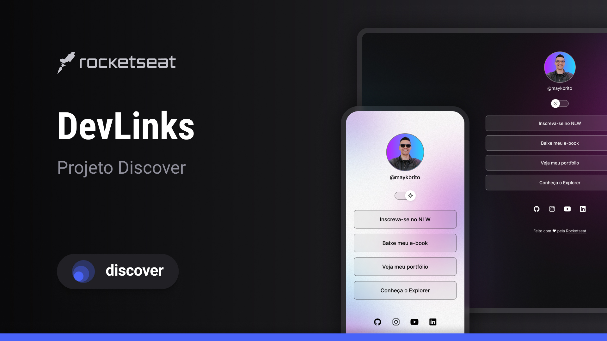

# DevLinks

A link aggregator page built as an online business card, developed during a Rocketseat course.

## **Preview**



## 💡 **Features**

- Toggle between light and dark themes
- Responsive design for mobile and desktop
- Social media icons with hover effects

## 🚀 **Technologies**

This project was built using the following technologies:

- **HTML5** and **CSS3**
- **JavaScript**
- **Git** and **GitHub**
- **Figma**

## 💻 **Project**

DevLinks is a simple tool to aggregate links, designed to serve as an online business card for showcasing projects and social profiles.

## 📱 **Layout**

You can view the project layout on [Figma](<https://www.figma.com/file/gRzxAc5PXhPJgVkN0Xki65/DevLinks-%E2%80%A2-Projeto-Discover-(Community)?type=design&node-id=0%3A1&mode=design&t=eOxjCko2SVR6fxoQ-1>). A [Figma](https://figma.com) account is required to access it.

## **Setup**

To run this project locally:

1. Clone the repository:

```bash
git clone https://github.com/mateuzito/devlinks.git
```

2. Open

```bash
index.html
```

in a web browser.

## **Deployment**

Check the live version: [https://mateussilva.vercel.app](https://mateussilva.vercel.app)

## :memo: **License**

This project is licensed under the [MIT License](https://opensource.org/licenses/MIT).  


## **Author**

Created by Mateus Silva ([@mateuzito](https://github.com/mateuzito)) during Rocketseat's free web development program.  
Made with ♥ by Rocketseat :wave: [Join their community!](https://discord.gg/rocketseat)
